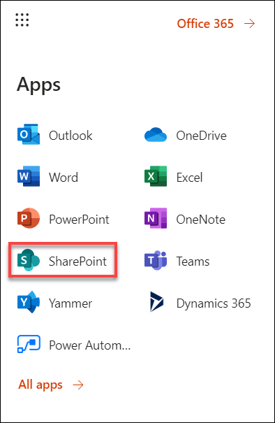
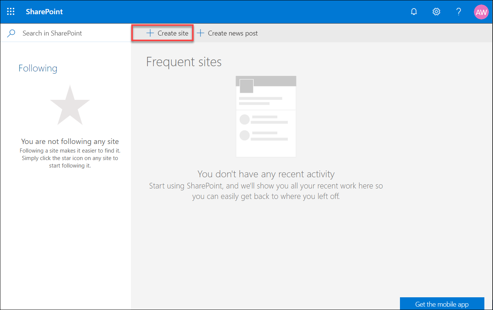
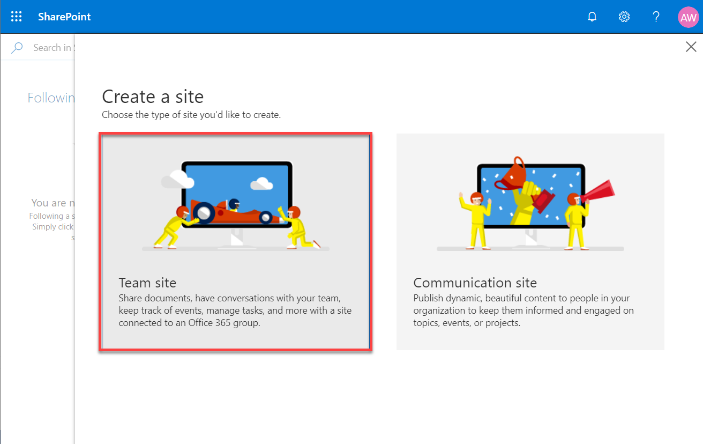
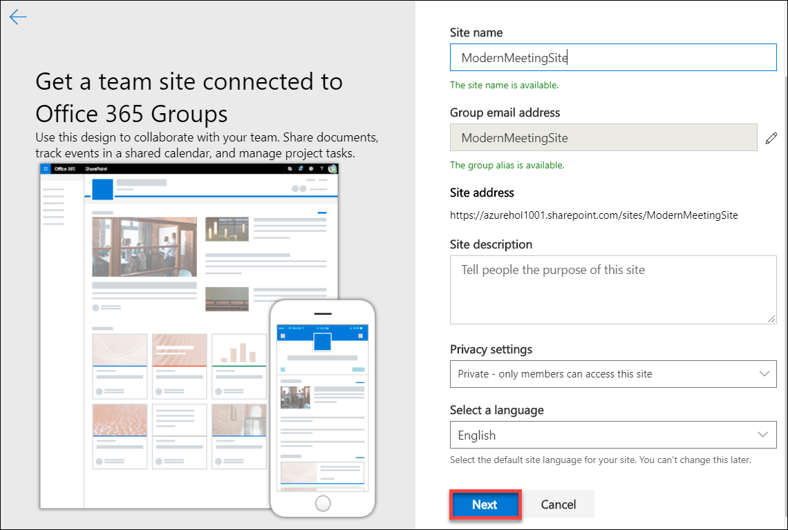
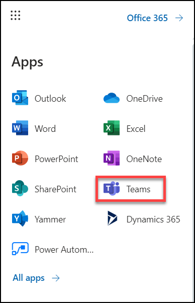

# Modern Meetings Experience

## Create Microsoft Teams Team Site

**Overview** 

The Modern Meeting solution utilizes a Microsoft Teams team site where users can access and run the Modern Meeting App. The following section describes the manual installation of this site. 

**Microsoft Teams team site (Manual Installation)**

For Manual Installation of the Microsoft Teams Team site follow the below steps: 

1. Open a browser and navigate to **https://portal.office.com/**
2. Login with the account which have Office 365 E5 license activated. 
3. Click on **App Launcher**

4. Once you launch the App, select **SharePoint**

5. Click on **+ Create Site** button.

6. Now select **Teams Site** to create a share point site

7. Enter name for Site name: **ModernMeetingSite** ( make sure the provided name should be available to use)

8. When you have completed filling out the information, Click **Next**.
9. You can add in additional owners and or members at this time or wait until later.
10. Click on **Finish** when prompted. 
11. Click on the **App Launcher** on the newly created site.

12. Locate the **Microsoft Teams**

13.	Once in Microsoft Teams, we are now going to create a new team based off the Office 365 group that was created when we created the SharePoint Team site. To do this, click on Join or create a team.
14. Click on **Create Teams**
15. To use the Office 365 group that was created when we made the SharePoint Teams site, click on Create a team from an existing Office 365 group.
16. 

